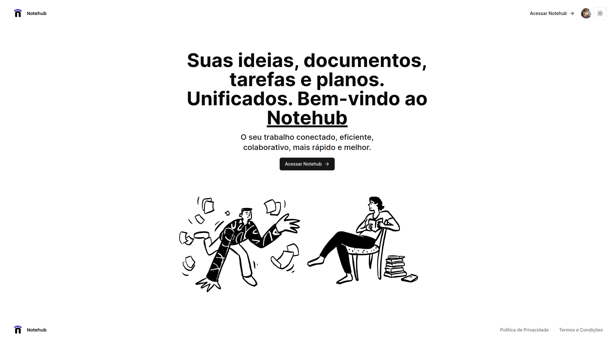
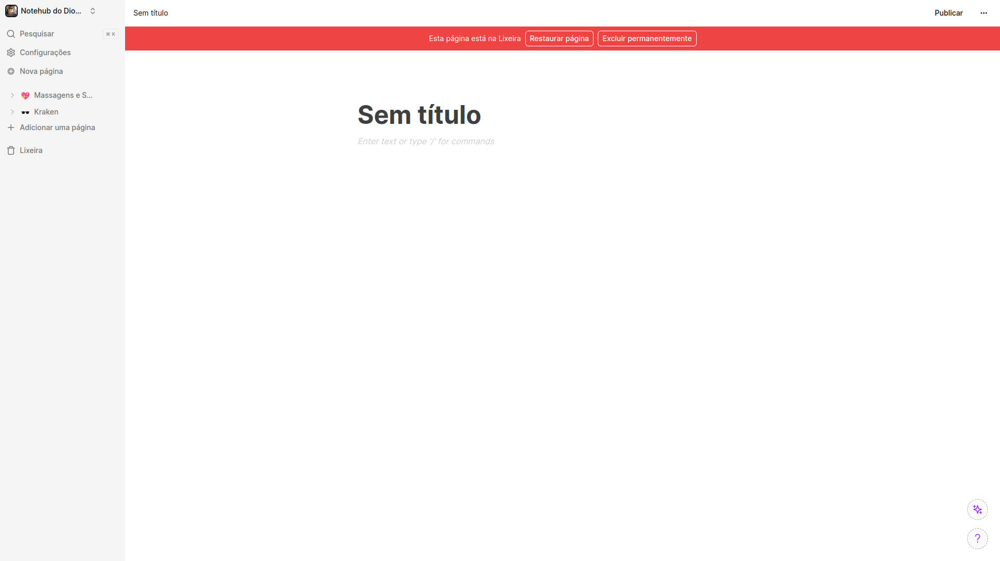

 

## 📄 Descrição

Esse clone do Notion foi desenvolvido com intuído de estudo, testei o RealTimeDB do SaaS (Convex - https://convex.dev/), BFF utilizando NextJS 14 e Server Components, utilizei ReactJS, NextJS, Convex (DB), Tailwind
Foi feito somente as funcionalidades básicas da aplicação mundialmente conhecida.

## 🌎 Versão Ao Vivo

## 🛠 Technologies

![react][react] ![nextjs][nextjs] ![tailwind css][tailwind] ![convex][convex]

## 📷 Screenshots

## 🦾 Sobre mim

[react]: https://img.shields.io/badge/react-1E4174?style=for-the-badge&logo=react&logoColor=white&labelColor=81D8F7

[convex]: https://img.shields.io/badge/convex-1E4174?style=for-the-badge&logo=convex&logoColor=black&labelColor=ffffff

[tailwind]: https://img.shields.io/badge/tailwind%20css-1E4174?style=for-the-badge&logo=tailwindcss&logoColor=white&labelColor=0EA5E9

[nextjs]: https://img.shields.io/badge/nextjs-1E4174?style=for-the-badge&logo=vercel&logoColor=white&labelColor=000000
